# อัลกอริทึมการเรียงลำดับ (Sorting Algorithms)

## วัตถุประสงค์
1. อธิบายหลักการทำงานของอัลกอริทึมการเรียงลำดับแบบต่างๆ
2. เขียนโค้ด Python เพื่อนำอัลกอริทึมการเรียงลำดับไปใช้งาน
3. วิเคราะห์และเปรียบเทียบประสิทธิภาพของอัลกอริทึมการเรียงลำดับแต่ละแบบ

## อุปกรณ์ที่ใช้
1. คอมพิวเตอร์ที่ติดตั้ง Python 3.x
2. โปรแกรม text editor หรือ IDE สำหรับเขียนโค้ด Python (เช่น VSCode, PyCharm)
3. ไลบรารี time สำหรับวัดประสิทธิภาพ

## เนื้อหาทฤษฎี
อัลกอริทึมการเรียงลำดับ (Sorting Algorithms) เป็นชุดคำสั่งที่ใช้ในการจัดเรียงข้อมูลให้อยู่ในลำดับที่ต้องการ ไม่ว่าจะเป็นลำดับจากน้อยไปมาก หรือจากมากไปน้อย ในใบงานจะศึกษาอัลกอริทึม 8 แบบ ได้แก่:

1. Bubble Sort
2. Insertion Sort
3. Selection Sort
4. Quick Sort
5. Shell Sort
6. Merge Sort
7. Radix Sort
8. Counting Sort


แต่ละอัลกอริทึมมีวิธีการทำงานและประสิทธิภาพที่แตกต่างกัน

## การทดลองที่ 1: Bubble Sort

### ทฤษฎี
Bubble Sort เป็นอัลกอริทึมที่ง่ายที่สุด โดยทำการเปรียบเทียบข้อมูลที่อยู่ติดกันทีละคู่ แล้วสลับตำแหน่งกันหากพบว่าข้อมูลไม่อยู่ในลำดับที่ถูกต้อง ทำซ้ำไปเรื่อยๆ จนกว่าข้อมูลทั้งหมดจะเรียงลำดับถูกต้อง

### ขั้นตอนการทดลอง
1. เขียนฟังก์ชัน Bubble Sort ตามโค้ดตัวอย่าง
```python
def bubble_sort(arr):
    n = len(arr)
    
    # ทำการวนลูปเพื่อเปรียบเทียบและสลับตำแหน่ง
    for i in range(n):
        # ในแต่ละรอบ ตัวเลขที่มีค่ามากที่สุดจะถูกเลื่อนไปทางขวาสุด
        # จึงไม่จำเป็นต้องตรวจสอบตำแหน่งที่เรียงลำดับแล้ว
        for j in range(0, n-i-1):
            # เปรียบเทียบคู่ติดกัน
            if arr[j] > arr[j+1]:
                # สลับตำแหน่ง
                arr[j], arr[j+1] = arr[j+1], arr[j]
    
    return arr
```

2. ทดสอบฟังก์ชันด้วยชุดข้อมูลต่อไปนี้
```python
import time

# ทดสอบ Bubble Sort
test_data = [64, 34, 25, 12, 22, 11, 45, 24, 6, 90]
print("ข้อมูลก่อนเรียง:", test_data)

start_time = time.time()
sorted_data = bubble_sort(test_data.copy())
end_time = time.time()

print("ข้อมูลหลังเรียง:", sorted_data)
print(f"เวลาที่ใช้: {(end_time - start_time)*1000:.6f} มิลลิวินาที")
```

### บันทึกผลการทดลอง
บันทึกรูปผลการทดลอง
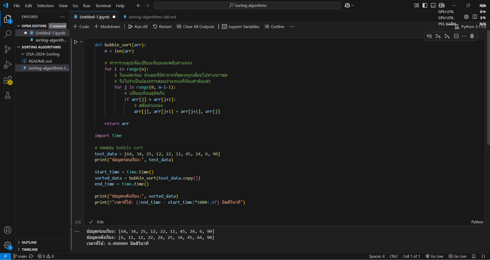

3. สังเกตขั้นตอนการเรียงลำดับโดยเพิ่มการแสดงผลในแต่ละรอบ
```python
def bubble_sort_with_steps(arr):
    n = len(arr)
    
    for i in range(n):
        swapped = False
        print(f"รอบที่ {i+1}:")
        
        for j in range(0, n-i-1):
            # แสดงการเปรียบเทียบในแต่ละขั้นตอน
            print(f"  เปรียบเทียบ {arr[j]} กับ {arr[j+1]}", end=" -> ")
            
            if arr[j] > arr[j+1]:
                arr[j], arr[j+1] = arr[j+1], arr[j]
                swapped = True
                print(f"สลับ: {arr}")
            else:
                print(f"ไม่สลับ: {arr}")
        
        # ถ้าไม่มีการสลับในรอบนี้ แสดงว่าข้อมูลเรียงเรียบร้อยแล้ว
        if not swapped:
            print(f"  ไม่มีการสลับในรอบนี้ - ข้อมูลเรียงลำดับแล้ว")
            break
    
    return arr

# ทดสอบแสดงขั้นตอน
test_data = [64, 34, 25, 12, 22, 11, 45, 24, 6, 90]
bubble_sort_with_steps(test_data.copy())
```
### บันทึกผลการทดลอง
บันทึกรูปผลการทดลอง
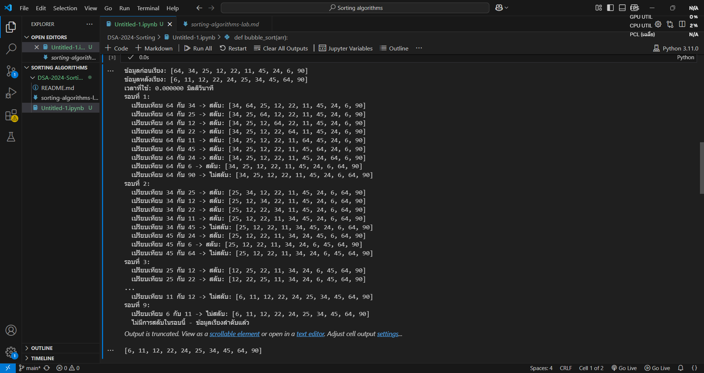

### แบบทดสอบ
1. ปรับปรุงโค้ด ในฟังก์ชัน bubble_sort(arr)  ให้มีประสิทธิภาพมากขึ้นโดยเพิ่มการตรวจสอบว่ามีการสลับตำแหน่งในแต่ละรอบหรือไม่ ถ้าไม่มีการสลับแสดงว่าข้อมูลเรียงลำดับแล้ว สามารถหยุดการทำงานได้ทันที
   ### บันทึกผลแบบทดสอบ
บันทึกโค้ดแบบทดสอบ
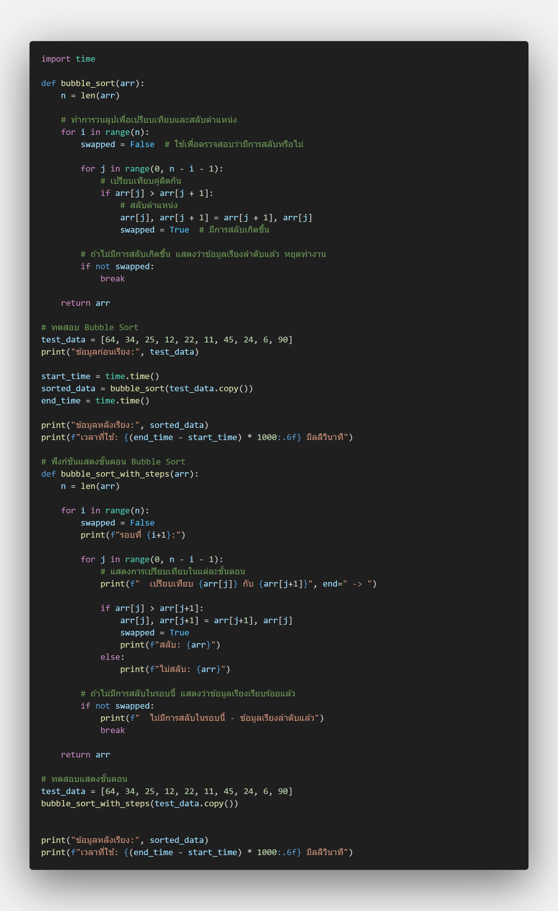
```python
บันทึกโค้ด แบบทดสอบ
```

บันทึกรูปผลแบบทดสอบ
.png>)

1. ทดสอบกับชุดข้อมูลที่เรียงลำดับแล้ว เช่น `[1, 2, 3, 4, 5,6,7,8,9,10]` และวัดประสิทธิภาพ
### บันทึกผลแบบทดสอบ
```html
 อธิบายผลที่นี่ 
เพิ่มตัวแปร swapped เพื่อตรวจสอบว่ามีการสลับเกิดขึ้นหรือไม่
หยุดการทำงานทันที หากไม่มีการสลับในรอบใดรอบหนึ่ง
[1, 2, 3, 4, 5, 6, 7, 8, 9, 10]
 ถ้าข้อมูล เรียงอยู่แล้ว  จะทำงานเพียง รอบเดียว แล้วหยุดเลย
```
บันทึกรูปผลแบบทดสอบ


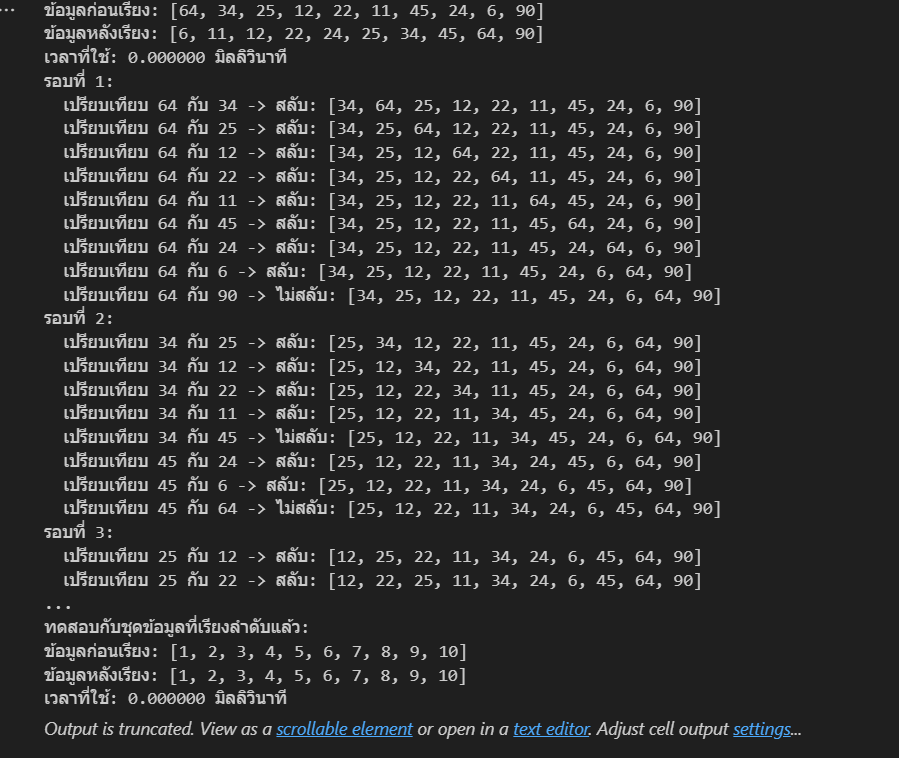


## การทดลองที่ 2: Insertion Sort
### ทฤษฎี
Insertion Sort คล้ายกับวิธีที่เราเรียงไพ่บนมือ โดยเริ่มจากข้อมูลตัวแรกแล้วค่อยๆ แทรกข้อมูลถัดไปเข้าไปในตำแหน่งที่เหมาะสม

### ขั้นตอนการทดลอง
1. เขียนฟังก์ชัน Insertion Sort ตามโค้ดตัวอย่าง
```python
def insertion_sort(arr):
    # วนลูปตั้งแต่ตัวที่ 2 ถึงตัวสุดท้าย
    for i in range(1, len(arr)):
        key = arr[i]  # ค่าที่จะนำไปแทรก
        j = i - 1  # ดัชนีของตัวก่อนหน้า
        
        # ย้ายตัวที่มีค่ามากกว่า key ไปทางขวา
        while j >= 0 and arr[j] > key:
            arr[j+1] = arr[j]
            j -= 1
        
        # แทรก key ลงในตำแหน่งที่เหมาะสม
        arr[j+1] = key
    
    return arr
```

2. ทดสอบฟังก์ชันด้วยชุดข้อมูลต่อไปนี้
```python
import time
# ทดสอบ Insertion Sort
test_data = [64, 34, 25, 12, 22, 11, 45, 24, 6, 90]
print("ข้อมูลก่อนเรียง:", test_data)

start_time = time.time()
sorted_data = insertion_sort(test_data.copy())
end_time = time.time()

print("ข้อมูลหลังเรียง:", sorted_data)
print(f"เวลาที่ใช้: {(end_time - start_time)*1000:.6f} มิลลิวินาที")
```
### บันทึกผลการทดลอง
บันทึกรูปผลการทดลอง

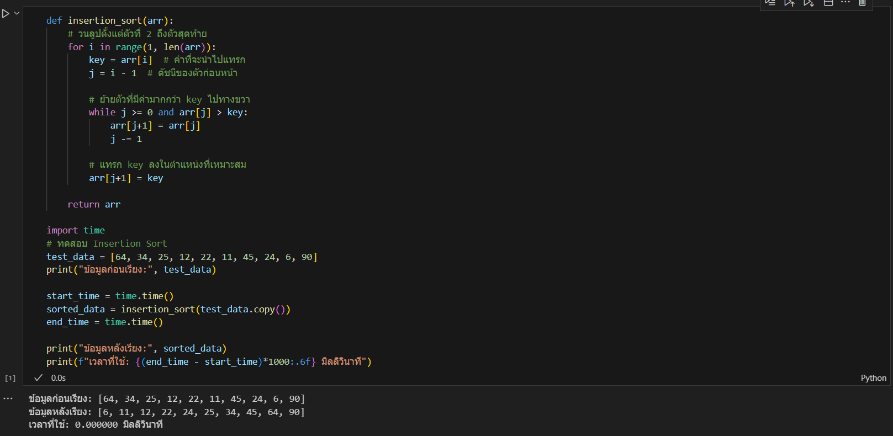

3. สังเกตขั้นตอนการเรียงลำดับโดยเพิ่มการแสดงผลในแต่ละรอบ
```python
def insertion_sort_with_steps(arr):
    print(f"เริ่มต้น: {arr}")
    
    for i in range(1, len(arr)):
        key = arr[i]
        j = i - 1
        print(f"\nรอบที่ {i}: พิจารณา key = {key}")
        
        while j >= 0 and arr[j] > key:
            arr[j+1] = arr[j]
            j -= 1
            print(f"  ย้าย {arr[j+2]} ไปทางขวา: {arr}")
        
        arr[j+1] = key
        print(f"  แทรก {key} ลงในตำแหน่ง {j+1}: {arr}")
    
    return arr

# ทดสอบแสดงขั้นตอน
test_data = [64, 34, 25, 12, 22, 11, 45, 24, 6, 90]
insertion_sort_with_steps(test_data.copy())
```
### บันทึกผลการทดลอง
บันทึกรูปผลการทดลอง
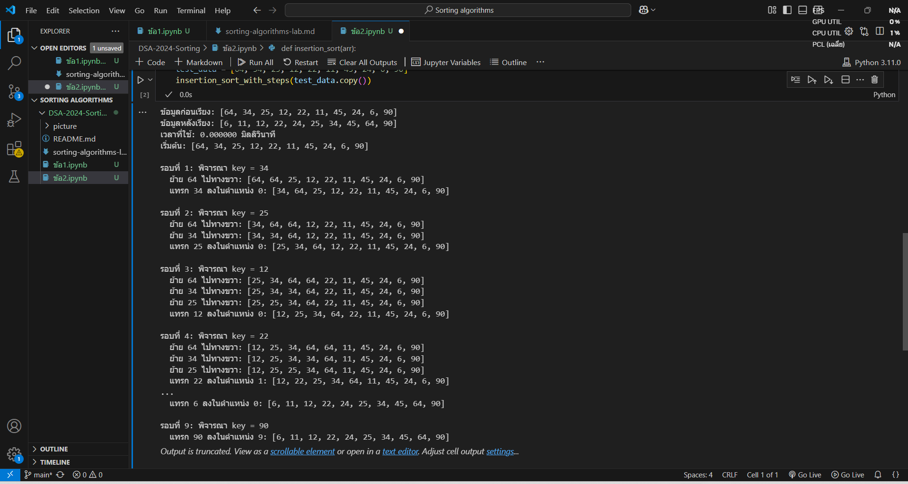

### แบบทดสอบ
1. ปรับปรุงอัลกอริทึม Insertion Sort ให้รองรับการเรียงลำดับจากมากไปน้อย
   ### บันทึกผลแบบทดสอบ
บันทึกโค้ดและรูปผลแบบทดสอบ
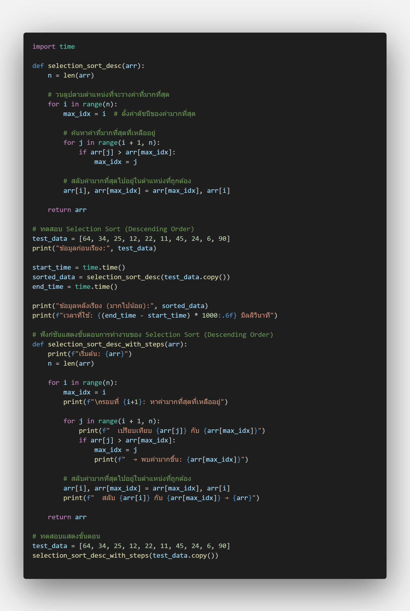
```python
บันทึกโค้ด แบบทดสอบ
```
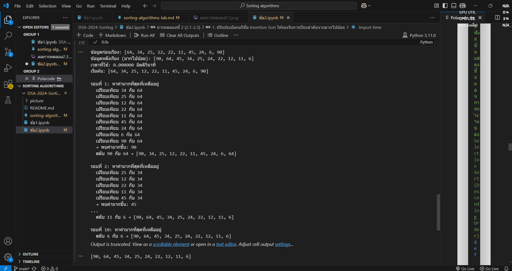

2. ทดสอบกับชุดข้อมูลที่มีค่าซ้ำกัน เช่น `[3, 1, 4, 1, 5, 9, 2, 6, 5, 9]` และตรวจสอบผลลัพธ์
### บันทึกผลแบบทดสอบ
```html
 อธิบายผลที่นี่
 จากการทดลองเมื่อมีข้อมูลซ้ำจะทำการเรียงเลขค่ามากไปน้อยตามปกติแต่เลขที่มีค่าเดียวกันจะอยู่ติดกัน
```
บันทึกรูปผลแบบทดสอบ


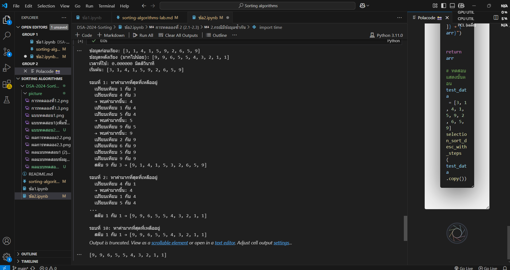


## การทดลองที่ 3: Selection Sort
### ทฤษฎี
Selection Sort ทำงานโดยการค้นหาค่าที่น้อยที่สุดในส่วนที่ยังไม่ได้เรียงลำดับ แล้วนำมาไว้ในตำแหน่งแรกของส่วนที่ยังไม่ได้เรียงลำดับ ทำซ้ำจนครบทุกตำแหน่ง

### ขั้นตอนการทดลอง
1. เขียนฟังก์ชัน Selection Sort ตามโค้ดตัวอย่าง
```python
def selection_sort(arr):
    n = len(arr)
    
    # วนลูปเพื่อหาค่าน้อยที่สุดในแต่ละรอบ
    for i in range(n):
        # สมมติว่าตำแหน่งปัจจุบันมีค่าน้อยที่สุด
        min_idx = i
        
        # หาค่าที่น้อยกว่าในส่วนที่เหลือ
        for j in range(i+1, n):
            if arr[j] < arr[min_idx]:
                min_idx = j
        
        # สลับค่าที่น้อยที่สุดกับตำแหน่งปัจจุบัน
        arr[i], arr[min_idx] = arr[min_idx], arr[i]
    
    return arr
```

2. ทดสอบฟังก์ชันด้วยชุดข้อมูลต่อไปนี้
```python
import time
# ทดสอบ Selection Sort
test_data = [64, 34, 25, 12, 22, 11, 45, 24, 6, 90]
print("ข้อมูลก่อนเรียง:", test_data)

start_time = time.time()
sorted_data = selection_sort(test_data.copy())
end_time = time.time()

print("ข้อมูลหลังเรียง:", sorted_data)
print(f"เวลาที่ใช้: {(end_time - start_time)*1000:.6f} มิลลิวินาที")
```
### บันทึกผลการทดลอง
บันทึกรูปผลการทดลอง

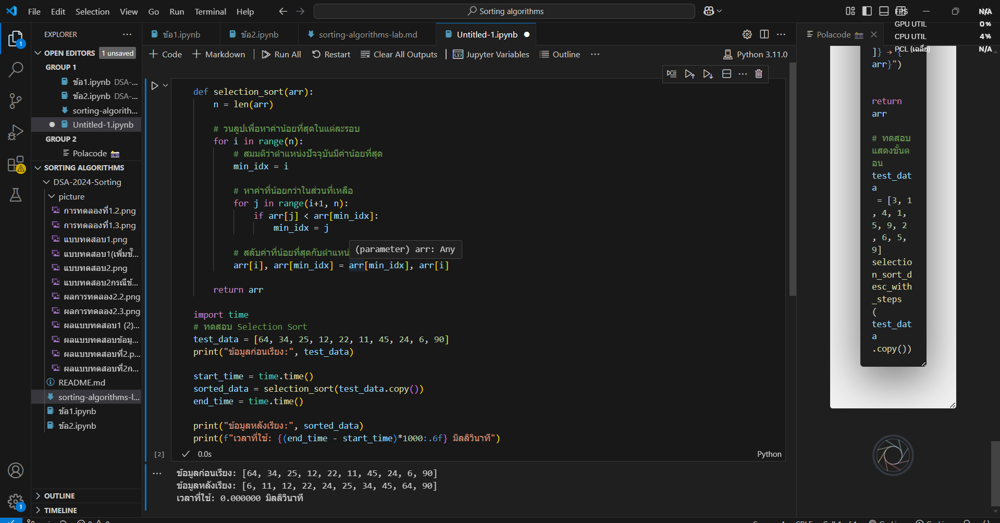

3. สังเกตขั้นตอนการเรียงลำดับโดยเพิ่มการแสดงผลในแต่ละรอบ
```python
def selection_sort_with_steps(arr):
    n = len(arr)
    
    for i in range(n):
        min_idx = i
        print(f"\nรอบที่ {i+1}:")
        print(f"  ข้อมูลปัจจุบัน: {arr}")
        print(f"  ค้นหาค่าน้อยที่สุดในตำแหน่ง {i} ถึง {n-1}")
        
        for j in range(i+1, n):
            print(f"    เปรียบเทียบ {arr[min_idx]} กับ {arr[j]}", end=" -> ")
            if arr[j] < arr[min_idx]:
                min_idx = j
                print(f"พบค่าที่น้อยกว่า: {arr[j]}")
            else:
                print("ไม่มีการเปลี่ยนแปลง")
        
        print(f"  ค่าน้อยที่สุดคือ {arr[min_idx]} ที่ตำแหน่ง {min_idx}")
        if i != min_idx:
            print(f"  สลับ {arr[i]} กับ {arr[min_idx]}")
            arr[i], arr[min_idx] = arr[min_idx], arr[i]
        else:
            print(f"  ไม่ต้องสลับเนื่องจากอยู่ในตำแหน่งที่ถูกต้องแล้ว")
        
        print(f"  ข้อมูลหลังรอบที่ {i+1}: {arr}")
    
    return arr

# ทดสอบแสดงขั้นตอน
test_data = [64, 34, 25, 12, 22, 11, 45, 24, 6, 90]
selection_sort_with_steps(test_data.copy())
```
### ผลการทดลอง 
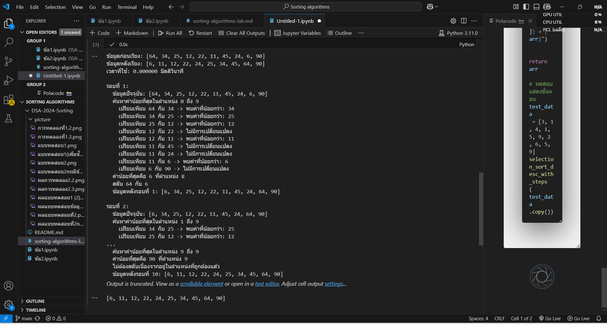
### แบบทดสอบ
1. ปรับปรุงอัลกอริทึม Selection Sort ให้รองรับการเรียงลำดับจากมากไปน้อย 
  ### บันทึกผลแบบทดสอบ
บันทึกโค้ดและรูปผลแบบทดสอบ
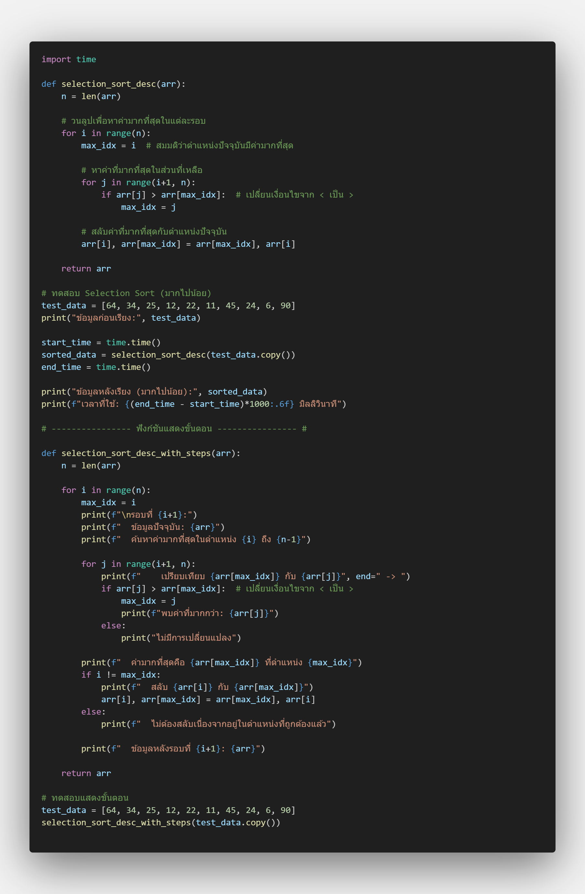
```python
บันทึกโค้ด แบบทดสอบ
```


2. วัดประสิทธิภาพเมื่อทดสอบกับชุดข้อมูลที่เกือบเรียงลำดับแล้ว (nearly sorted data)
### บันทึกผลแบบทดสอบ
```html
 อธิบายผลที่นี่
 จากการทดลองเมื่อทำการใส่ข้อมุลที่เกือบจะเรียงลำดับแล้วแต่เรียงผิดเป็นจากน้อยไปมาก ก็ จะทำการมาเรียงใหม่เป็นจากมากไปน้อยแทน พบว่ามีระยะเวลาในการเรียงเท่ากัน
```
บันทึกรูปผลแบบทดสอบ

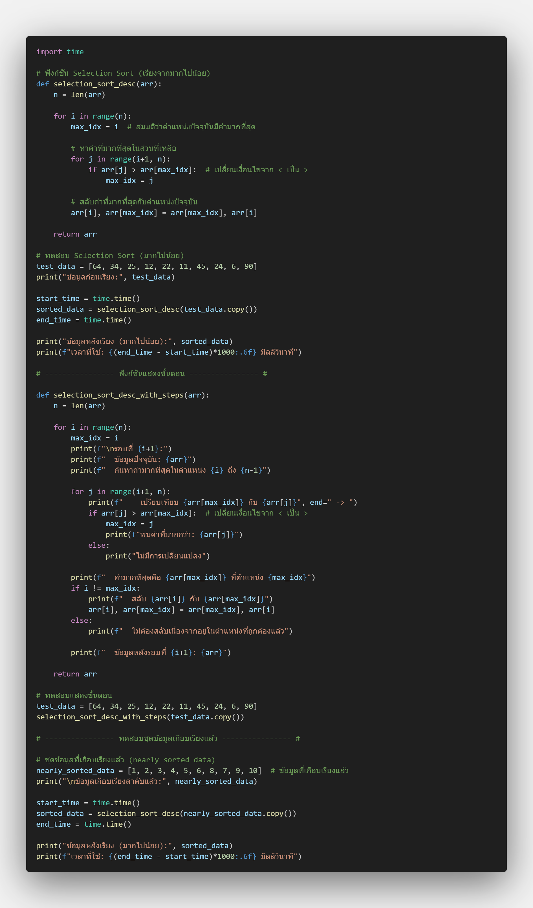

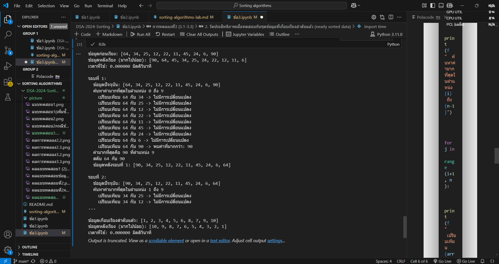


## การทดลองที่ 4: Quick Sort

### ทฤษฎี
Quick Sort เป็นอัลกอริทึมที่ใช้หลักการ "แบ่งแล้วเอาชนะ" (divide and conquer) โดยเลือกตัวเลขหนึ่งเป็น "pivot" แล้วแบ่งข้อมูลออกเป็นสองส่วน: ส่วนที่น้อยกว่า pivot และส่วนที่มากกว่า pivot จากนั้นทำซ้ำกับแต่ละส่วนย่อย

### ขั้นตอนการทดลอง
1. เขียนฟังก์ชัน Quick Sort ตามโค้ดตัวอย่าง
```python
def quick_sort(arr):
    if len(arr) <= 1:
        return arr
    
    # เลือก pivot (ในที่นี้เลือกตัวสุดท้าย)
    pivot = arr[-1]
    
    # แบ่งข้อมูลเป็นสองส่วน
    left = [x for x in arr[:-1] if x <= pivot]
    right = [x for x in arr[:-1] if x > pivot]
    
    # รวมผลลัพธ์
    return quick_sort(left) + [pivot] + quick_sort(right)
```

2. ทดสอบฟังก์ชันด้วยชุดข้อมูลต่อไปนี้
```python
import time
# ทดสอบ Quick Sort
test_data = [64, 34, 25, 12, 22, 11, 45, 24, 6, 90]
print("ข้อมูลก่อนเรียง:", test_data)

start_time = time.time()
sorted_data = quick_sort(test_data.copy())
end_time = time.time()

print("ข้อมูลหลังเรียง:", sorted_data)
print(f"เวลาที่ใช้: {(end_time - start_time)*1000:.6f} มิลลิวินาที")
```

### บันทึกผลการทดลอง
บันทึกรูปผลการทดลอง


3. เขียนฟังก์ชันที่แสดงขั้นตอนการทำงาน
```python
def quick_sort_with_steps(arr, depth=0):
    indent = "  " * depth
    print(f"{indent}quick_sort({arr})")
    
    if len(arr) <= 1:
        print(f"{indent}ข้อมูลมีขนาด <= 1, ส่งคืน {arr}")
        return arr
    
    pivot = arr[-1]
    print(f"{indent}เลือก pivot = {pivot}")
    
    left = [x for x in arr[:-1] if x <= pivot]
    right = [x for x in arr[:-1] if x > pivot]
    
    print(f"{indent}แบ่งข้อมูล: left = {left}, right = {right}")
    
    result = quick_sort_with_steps(left, depth + 1) + [pivot] + quick_sort_with_steps(right, depth + 1)
    print(f"{indent}ผลลัพธ์รวม: {result}")
    
    return result

# ทดสอบแสดงขั้นตอน
test_data = [64, 34, 25, 12, 22, 11, 45, 24, 6, 90]
quick_sort_with_steps(test_data.copy())
```

### บันทึกผลการทดลอง
บันทึกรูปผลการทดลอง


### แบบทดสอบ
1. ปรับปรุงการเลือก pivot โดยใช้การเปรียบเทียบตำแหน่งแรก ตำแหน่งตรงกลาง และแหน่งสุดท้าย
   ### บันทึกผลแบบทดสอบ
บันทึกโค้ดและรูปผลแบบทดสอบ
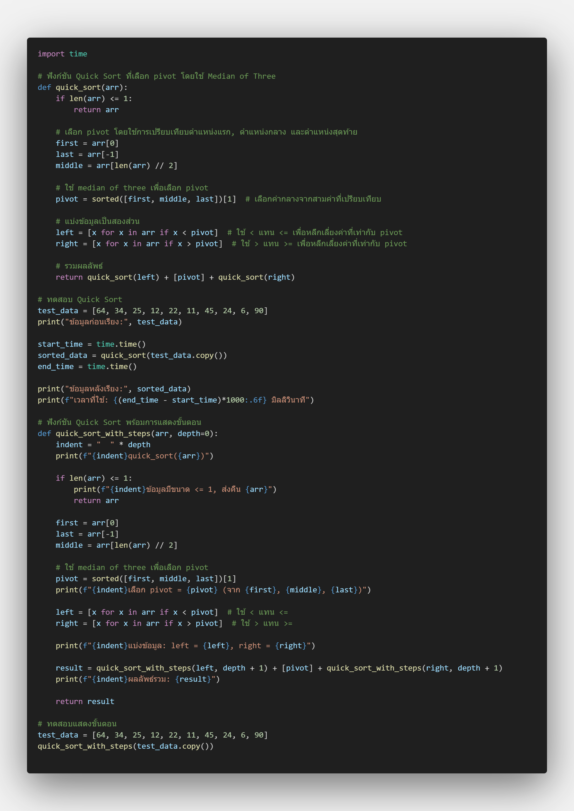
```python
บันทึกโค้ด แบบทดสอบ
```


2. ทดสอบกับชุดข้อมูลที่มีค่าซ้ำกันจำนวนมาก และตรวจสอบผลลัพธ์
### บันทึกผลแบบทดสอบ
บันทึกโค้ดและรูปผลแบบทดสอบ
```html
 อธิบายผลที่นี่
 เมื่อทดสอบกับชุดข้อมูลที่มีค่าซ้ำกันจำนวนมาก เช่น [5, 3, 8, 3, 5, 9, 5, 1, 5, 8, 3, 5, 9, 5] ผลลัพธ์ที่ได้จากการเรียงลำดับโดยใช้ Quick Sort คือ [1, 3, 5, 8, 9] ซึ่งแสดงว่า
การเลือก pivot: การเลือก pivot ด้วยวิธี median of three (การเลือกค่ากลางจากสามค่าที่เปรียบเทียบกัน ได้แก่ ตำแหน่งแรก ตำแหน่งกลาง และตำแหน่งสุดท้าย) 
การซ้ำกันของค่าภายในข้อมูล: ค่าที่ซ้ำกัน (เช่น 5 และ 3) จะยังคงอยู่ในผลลัพธ์ โดยจัดเรียงในลำดับที่ถูกต้องและไม่หายไปจากชุดข้อมูล
ผลลัพธ์: ลำดับของข้อมูลที่ได้คือ [1, 3, 5, 8, 9] ซึ่งหมายความว่า Quick Sort สามารถจัดเรียงข้อมูลได้อย่างถูกต้อง แม้ว่าจะมีค่าซ้ำกันในชุดข้อมูล
```
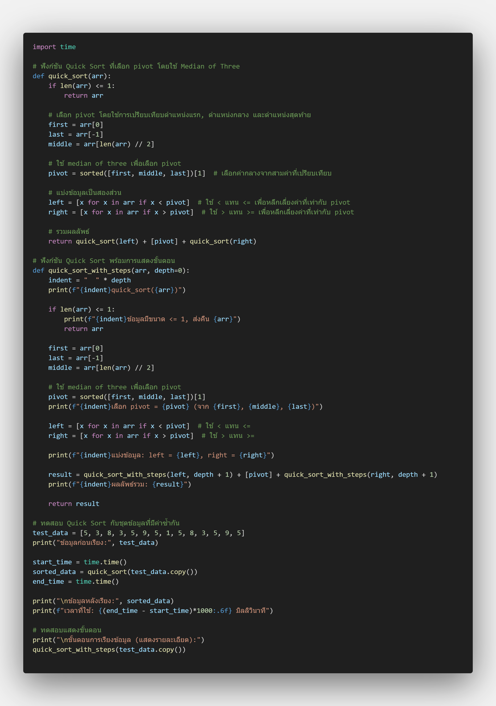


## การทดลองที่ 5: Shell Sort

### ทฤษฎี
Shell Sort เป็นการปรับปรุงจาก Insertion Sort โดยเริ่มจากการเปรียบเทียบและสลับตำแหน่งของข้อมูลที่อยู่ห่างกันด้วยระยะทางค่อนข้างมากก่อน แล้วค่อยๆ ลดระยะทางลงจนเป็นการเปรียบเทียบข้อมูลที่อยู่ติดกัน

### ขั้นตอนการทดลอง
1. เขียนฟังก์ชัน Shell Sort ตามโค้ดตัวอย่าง
```python
def shell_sort(arr):
    n = len(arr)
    gap = n // 2  # กำหนดระยะห่างเริ่มต้น
    
    # ลดระยะห่างลงเรื่อยๆ จนเหลือ 1
    while gap > 0:
        # ใช้ Insertion Sort กับแต่ละกลุ่มของข้อมูลที่ห่างกันด้วยระยะ gap
        for i in range(gap, n):
            temp = arr[i]
            j = i
            
            # ย้ายตัวที่มีค่ามากกว่า temp ไปทางขวา
            while j >= gap and arr[j - gap] > temp:
                arr[j] = arr[j - gap]
                j -= gap
            
            # ใส่ temp ลงในตำแหน่งที่เหมาะสม
            arr[j] = temp
        
        # ลดระยะห่างลงครึ่งหนึ่ง
        gap //= 2
    
    return arr
```

2. ทดสอบฟังก์ชันด้วยชุดข้อมูลต่อไปนี้
```python
import time
# ทดสอบ Shell Sort
test_data = [64, 34, 25, 12, 22, 11, 45, 24, 6, 90]
print("ข้อมูลก่อนเรียง:", test_data)

start_time = time.time()
sorted_data = shell_sort(test_data.copy())
end_time = time.time()

print("ข้อมูลหลังเรียง:", sorted_data)
print(f"เวลาที่ใช้: {(end_time - start_time)*1000:.6f} มิลลิวินาที")
```
### บันทึกผลการทดลอง
บันทึกรูปผลการทดลอง   อยู่ในไฟล์ข้อ5.ipynb ครับ


3. เขียนฟังก์ชันที่แสดงขั้นตอนการทำงาน
```python
def shell_sort_with_steps(arr):
    n = len(arr)
    gap = n // 2
    
    print(f"เริ่มต้น: {arr}")
    
    while gap > 0:
        print(f"\nกำหนดระยะห่าง (gap) = {gap}")
        
        for i in range(gap, n):
            temp = arr[i]
            j = i
            
            print(f"  พิจารณาตำแหน่ง {i} (ค่า {temp}):")
            
            while j >= gap and arr[j - gap] > temp:
                print(f"    เปรียบเทียบกับตำแหน่ง {j-gap} (ค่า {arr[j-gap]}) -> ย้าย {arr[j-gap]} ไปตำแหน่ง {j}")
                arr[j] = arr[j - gap]
                j -= gap
            
            if j != i:
                print(f"    ใส่ {temp} ลงในตำแหน่ง {j}")
                arr[j] = temp
            else:
                print(f"    ไม่มีการเปลี่ยนแปลง")
            
            print(f"    ข้อมูลหลังการพิจารณา: {arr}")
        
        gap //= 2
    
    return arr

# ทดสอบแสดงขั้นตอน
test_data = [64, 34, 25, 12, 22, 11, 45, 24, 6, 90]
shell_sort_with_steps(test_data.copy())
```
### บันทึกผลการทดลอง
บันทึกรูปผลการทดลอง  อยู่ในไฟล์ข้อ5.ipynb ครับ


### แบบทดสอบ
1. เปรียบเทียบประสิทธิภาพกับ Insertion Sort ปกติเมื่อทดสอบกับชุดข้อมูลขนาดใหญ่   อยู่ในไฟล์ข้อ5.ipynb ครับ
   ### บันทึกผลแบบทดสอบ
```html
 อธิบายผลที่นี่
```
บันทึกรูปผลแบบทดสอบ   

  

2. ทดสอบกับชุดข้อมูลที่เกือบเรียงลำดับแล้ว และวัดประสิทธิภาพ   อยู่ในไฟล์ข้อ5.ipynb ครับ
### บันทึกผลแบบทดสอบ
```html
 อธิบายผลที่นี่  จากการทดลองเมื่อข้อมูลมีขนาดใหญ่จะใช้เวลาการประมวลผลนานขึ้น ถ้าเป็นข้อมูลที่เกือบเรียงแล้วจะประมวลผลเร็วกว่า
```
บันทึกรูปผลแบบทดสอบ


## การทดลองที่ 6: Merge Sort

### ทฤษฎี
Merge Sort เป็นอัลกอริทึมที่ใช้หลักการ "แบ่งแล้วเอาชนะ" เช่นเดียวกับ Quick Sort แต่ทำงานโดยการแบ่งข้อมูลออกเป็นสองส่วนเท่าๆ กัน เรียงลำดับแต่ละส่วน แล้วรวมกลับเข้าด้วยกัน

### ขั้นตอนการทดลอง
1. เขียนฟังก์ชัน Merge Sort ตามโค้ดตัวอย่าง
```python
def merge_sort(arr):
    if len(arr) <= 1:
        return arr
    
    # แบ่งข้อมูลออกเป็นสองส่วน
    mid = len(arr) // 2
    left = arr[:mid]
    right = arr[mid:]
    
    # เรียกใช้ recursive กับส่วนย่อย
    left = merge_sort(left)
    right = merge_sort(right)
    
    # รวมสองส่วนกลับเข้าด้วยกัน
    return merge(left, right)

def merge(left, right):
    result = []
    i = j = 0
    
    # เปรียบเทียบและนำค่าที่น้อยกว่าใส่ในผลลัพธ์
    while i < len(left) and j < len(right):
        if left[i] <= right[j]:
            result.append(left[i])
            i += 1
        else:
            result.append(right[j])
            j += 1
    
    # เพิ่มส่วนที่เหลือ
    result.extend(left[i:])
    result.extend(right[j:])
    
    return result
```

2. ทดสอบฟังก์ชันด้วยชุดข้อมูลต่อไปนี้
```python
import time
# ทดสอบ Merge Sort
test_data = [64, 34, 25, 12, 22, 11, 45, 24, 6, 90]
print("ข้อมูลก่อนเรียง:", test_data)

start_time = time.time()
sorted_data = merge_sort(test_data.copy())
end_time = time.time()

print("ข้อมูลหลังเรียง:", sorted_data)
print(f"เวลาที่ใช้: {(end_time - start_time)*1000:.6f} มิลลิวินาที")
```

### บันทึกผลการทดลอง
บันทึกรูปผลการทดลอง  อยู่ในไฟล์ข้อ6.ipynb ครับ


3. เขียนฟังก์ชันที่แสดงขั้นตอนการทำงาน
```python
def merge_sort_with_steps(arr, depth=0):
    indent = "  " * depth
    print(f"{indent}merge_sort({arr})")
    
    if len(arr) <= 1:
        print(f"{indent}ข้อมูลมีขนาด <= 1, ส่งคืน {arr}")
        return arr
    
    # แบ่งข้อมูลออกเป็นสองส่วน
    mid = len(arr) // 2
    left = arr[:mid]
    right = arr[mid:]
    
    print(f"{indent}แบ่งข้อมูล: left = {left}, right = {right}")
    
    # เรียกใช้ recursive กับส่วนย่อย
    left = merge_sort_with_steps(left, depth + 1)
    right = merge_sort_with_steps(right, depth + 1)
    
    # รวมสองส่วนกลับเข้าด้วยกัน
    result = merge_with_steps(left, right, depth)
    print(f"{indent}ผลลัพธ์รวม: {result}")
    
    return result

def merge_with_steps(left, right, depth=0):
    indent = "  " * depth
    print(f"{indent}merge({left}, {right})")
    
    result = []
    i = j = 0
    
    # เปรียบเทียบและนำค่าที่น้อยกว่าใส่ในผลลัพธ์
    while i < len(left) and j < len(right):
        if left[i] <= right[j]:
            print(f"{indent}  {left[i]} <= {right[j]}, เลือก {left[i]} จาก left")
            result.append(left[i])
            i += 1
        else:
            print(f"{indent}  {left[i]} > {right[j]}, เลือก {right[j]} จาก right")
            result.append(right[j])
            j += 1
        print(f"{indent}  ผลลัพธ์ชั่วคราว: {result}")
    
    # เพิ่มส่วนที่เหลือ
    if i < len(left):
        print(f"{indent}  เพิ่มส่วนที่เหลือจาก left: {left[i:]}")
        result.extend(left[i:])
    if j < len(right):
        print(f"{indent}  เพิ่มส่วนที่เหลือจาก right: {right[j:]}")
        result.extend(right[j:])
    
    print(f"{indent}  ผลลัพธ์สุดท้าย: {result}")
    return result

# ทดสอบแสดงขั้นตอน
test_data = [64, 34, 25, 12, 22, 11, 45, 24, 6, 90]
merge_sort_with_steps(test_data.copy())

### บันทึกผลการทดลอง
บันทึกรูปผลการทดลอง อยู่ในไฟล์ข้อ6.ipynb ครับ


```

### แบบทดสอบ

1. ทดสอบกับชุดข้อมูลที่เกือบเรียงลำดับแล้ว และวัดประสิทธิภาพ
### บันทึกผลแบบทดสอบ
```html
 อธิบายผลที่นี่  
 จากการทดลองพบว่าเมื่อทดสอบกัีบข้อมูลที่เรียงลำดับแล้วไม่มีผลเรื่องความเร็วในการประมวล
```
บันทึกรูปผลแบบทดสอบ อยู่ในไฟล์ข้อ6.ipynb ครับ


## เปรียบเทียบประสิทธิภาพการเรียงข้อมูลแต่ละวิธี
1. สร้างไฟล์เพื่อรวมโค้ดการเรียงข้อมูลทุกแบบ ตั้งชื่อไฟล์ sorting.py
```python
def bubble_sort(arr):
    n = len(arr)
    
    # ทำการวนลูปเพื่อเปรียบเทียบและสลับตำแหน่ง
    for i in range(n):
        # ในแต่ละรอบ ตัวเลขที่มีค่ามากที่สุดจะถูกเลื่อนไปทางขวาสุด
        # จึงไม่จำเป็นต้องตรวจสอบตำแหน่งที่เรียงลำดับแล้ว
        for j in range(0, n-i-1):
            # เปรียบเทียบคู่ติดกัน
            if arr[j] > arr[j+1]:
                # สลับตำแหน่ง
                arr[j], arr[j+1] = arr[j+1], arr[j]
    
    return arr

def insertion_sort(arr):
    # วนลูปตั้งแต่ตัวที่ 2 ถึงตัวสุดท้าย
    for i in range(1, len(arr)):
        key = arr[i]  # ค่าที่จะนำไปแทรก
        j = i - 1  # ดัชนีของตัวก่อนหน้า
        
        # ย้ายตัวที่มีค่ามากกว่า key ไปทางขวา
        while j >= 0 and arr[j] > key:
            arr[j+1] = arr[j]
            j -= 1
        
        # แทรก key ลงในตำแหน่งที่เหมาะสม
        arr[j+1] = key
    
    return arr
def selection_sort(arr):
    n = len(arr)
    
    # วนลูปเพื่อหาค่าน้อยที่สุดในแต่ละรอบ
    for i in range(n):
        # สมมติว่าตำแหน่งปัจจุบันมีค่าน้อยที่สุด
        min_idx = i
        
        # หาค่าที่น้อยกว่าในส่วนที่เหลือ
        for j in range(i+1, n):
            if arr[j] < arr[min_idx]:
                min_idx = j
        
        # สลับค่าที่น้อยที่สุดกับตำแหน่งปัจจุบัน
        arr[i], arr[min_idx] = arr[min_idx], arr[i]
    
    return arr

def quick_sort(arr):
    if len(arr) <= 1:
        return arr
    
    # เลือก pivot (ในที่นี้เลือกตัวสุดท้าย)
    pivot = arr[-1]
    
    # แบ่งข้อมูลเป็นสองส่วน
    left = [x for x in arr[:-1] if x <= pivot]
    right = [x for x in arr[:-1] if x > pivot]
    
    # รวมผลลัพธ์
    return quick_sort(left) + [pivot] + quick_sort(right)

def shell_sort(arr):
    n = len(arr)
    gap = n // 2  # กำหนดระยะห่างเริ่มต้น
    
    # ลดระยะห่างลงเรื่อยๆ จนเหลือ 1
    while gap > 0:
        # ใช้ Insertion Sort กับแต่ละกลุ่มของข้อมูลที่ห่างกันด้วยระยะ gap
        for i in range(gap, n):
            temp = arr[i]
            j = i
            
            # ย้ายตัวที่มีค่ามากกว่า temp ไปทางขวา
            while j >= gap and arr[j - gap] > temp:
                arr[j] = arr[j - gap]
                j -= gap
            
            # ใส่ temp ลงในตำแหน่งที่เหมาะสม
            arr[j] = temp
        
        # ลดระยะห่างลงครึ่งหนึ่ง
        gap //= 2
    
    return arr

def merge_sort(arr):
    if len(arr) <= 1:
        return arr
    
    # แบ่งข้อมูลออกเป็นสองส่วน
    mid = len(arr) // 2
    left = arr[:mid]
    right = arr[mid:]
    
    # เรียกใช้ recursive กับส่วนย่อย
    left = merge_sort(left)
    right = merge_sort(right)
    
    # รวมสองส่วนกลับเข้าด้วยกัน
    return merge(left, right)

def merge(left, right):
    result = []
    i = j = 0
    
    # เปรียบเทียบและนำค่าที่น้อยกว่าใส่ในผลลัพธ์
    while i < len(left) and j < len(right):
        if left[i] <= right[j]:
            result.append(left[i])
            i += 1
        else:
            result.append(right[j])
            j += 1
    
    # เพิ่มส่วนที่เหลือ
    result.extend(left[i:])
    result.extend(right[j:])
    
    return result
def counting_sort(arr):
    # หาค่าสูงสุดและต่ำสุดในข้อมูล
    max_val = max(arr)
    min_val = min(arr)
    
    # คำนวณขนาดของตารางนับ
    range_of_elements = max_val - min_val + 1
    
    # สร้างตารางนับและอาร์เรย์ผลลัพธ์
    count = [0] * range_of_elements
    output = [0] * len(arr)
    
    # นับจำนวนของแต่ละค่า
    for i in range(len(arr)):
        count[arr[i] - min_val] += 1
    
    # ปรับตารางนับให้เป็นตำแหน่งสะสม
    for i in range(1, len(count)):
        count[i] += count[i - 1]
    
    # สร้างอาร์เรย์ผลลัพธ์ (เริ่มจากท้ายสุดเพื่อให้ stable)
    for i in range(len(arr) - 1, -1, -1):
        output[count[arr[i] - min_val] - 1] = arr[i]
        count[arr[i] - min_val] -= 1
    
    # คัดลอกผลลัพธ์กลับไปยังอาร์เรย์ต้นฉบับ
    for i in range(len(arr)):
        arr[i] = output[i]
    
    return arr

def radix_sort(arr):
    # หาค่าสูงสุดเพื่อกำหนดจำนวนรอบการเรียงลำดับ
    max_val = max(arr)
    
    # เรียงลำดับตามแต่ละหลัก
    exp = 1
    while max_val // exp > 0:
        counting_sort_by_digit(arr, exp)
        exp *= 10
    
    return arr

def counting_sort_by_digit(arr, exp):
    n = len(arr)
    output = [0] * n
    count = [0] * 10  # มี 10 หลัก (0-9)
    
    # นับจำนวนของแต่ละหลัก
    for i in range(n):
        digit = (arr[i] // exp) % 10
        count[digit] += 1
    
    # ปรับตารางนับให้เป็นตำแหน่งสะสม
    for i in range(1, 10):
        count[i] += count[i - 1]
    
    # สร้างอาร์เรย์ผลลัพธ์
    for i in range(n - 1, -1, -1):
        digit = (arr[i] // exp) % 10
        output[count[digit] - 1] = arr[i]
        count[digit] -= 1
    
    # คัดลอกผลลัพธ์กลับไปยังอาร์เรย์ต้นฉบับ
    for i in range(n):
        arr[i] = output[i]
```
2. เขียนโค้ดเพื่อเปรียบเทียบการเรียงข้อมูลแต่ละแบบเมื่อใช้กับอินพุตแต่ละขนาดตามตัวอย่าง การเปรียบเทียบ Bubble sort, Insertion sort และ Selection sort
   ** ทำการติดตั้ง matplotlib ด้วยคำสั่ง  pip install matplotlib  หรือ pip3 install matplotlib **
```python
import random
import time
import matplotlib.pyplot as plt
import sorting

def compare_sort():
    # ทดสอบกับขนาดข้อมูลต่างๆ
    sizes = [100,500, 1000, 5000, 10000, 20000]
    bubble_times = []
    insertion_times = []
    selection_times =[]
    
    for size in sizes:
        # สร้างชุดข้อมูลแบบสุ่มในช่วง 0-999
        data = [random.randint(0, 999) for _ in range(size)]
        
        # วัดเวลา bubble Sort
        start_time = time.time()
        sorttype.bubble_sort(data.copy())
        bubble_times.append((time.time() - start_time) * 1000)
        
        # วัดเวลา insertion Sort
        start_time = time.time()
        sorttype.insertion_sort(data.copy())
        insertion_times.append((time.time() - start_time) * 1000)

            # วัดเวลา selection Sort
        start_time = time.time()
        sorttype.selection_sort(data.copy())
        selection_times.append((time.time() - start_time) * 1000)

        print(f"ขนาดข้อมูล {size}:")
        print(f"  Bubble Sort: {bubble_times[-1]:.2f} มิลลิวินาที")
        print(f"  Insertion Sort: {insertion_times[-1]:.2f} มิลลิวินาที")
        print(f"  Selection Sort: {selection_times[-1]:.2f} มิลลิวินาที")

    # แสดงผลลัพธ์เป็นกราฟ
    plt.figure(figsize=(10, 6))
    plt.plot(sizes, bubble_times, marker='o', label='Bubble Sort')
    plt.plot(sizes, insertion_times, marker='d', label='Insertion Sort')
    plt.plot(sizes, selection_times, marker='s', label='Selection Sort')
    plt.title('Performance comparison of sorting (Data 0-999). Created By [Student Name]')
    plt.xlabel('Input Size')
    plt.ylabel('Time (Milliseconds)')
    plt.legend()
    plt.grid(True)
    plt.savefig('Performance.png')
    plt.show()

# เปรียบเทียบประสิทธิภาพ
sorttype=sorting

compare_sort()
```

### บันทึกรูปผลการทดลอง
ผลการเปรียบเทียบ Bubble sort, Insertion sort, Selection sort


ผลการเปรียบเทียบ Selection sort, shell sort, quick sort

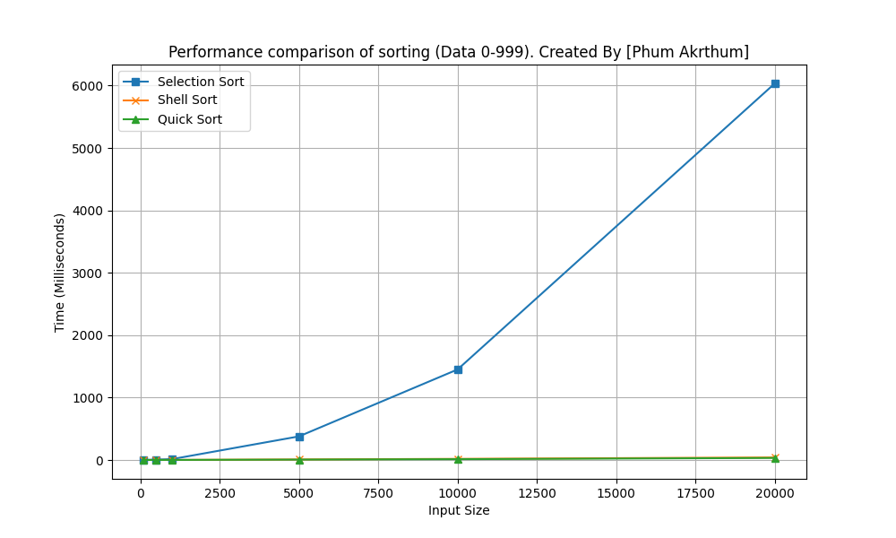

ผลการเปรียบเทียบ shell sort, quick sort, radix sort

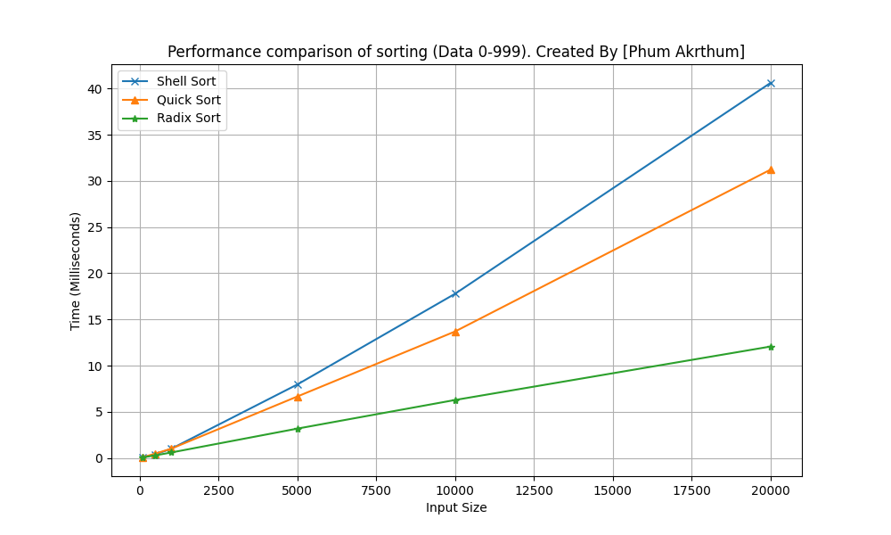
ผลการเปรียบเทียบ shell sort, quick sort, radix sort, couting sort

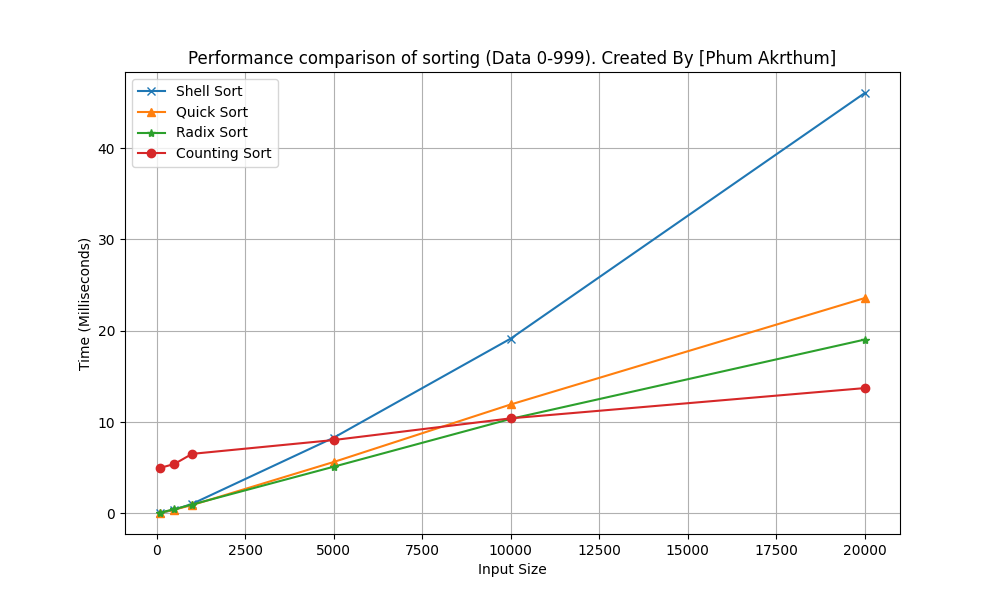

3. ทดลองเปลี่ยนค่าช่วงข้อมูลให้มีขนาดกว้างขึ้น โดยเปลี่ยนค่า 999 เป็น 99999
   ```python
           # สร้างชุดข้อมูลแบบสุ่มในช่วง 0-999
        data = [random.randint(0, 99999) for _ in range(size)]
   ```

   ผลการเปรียบเทียบ Bubble sort, Insertion sort, Selection sort

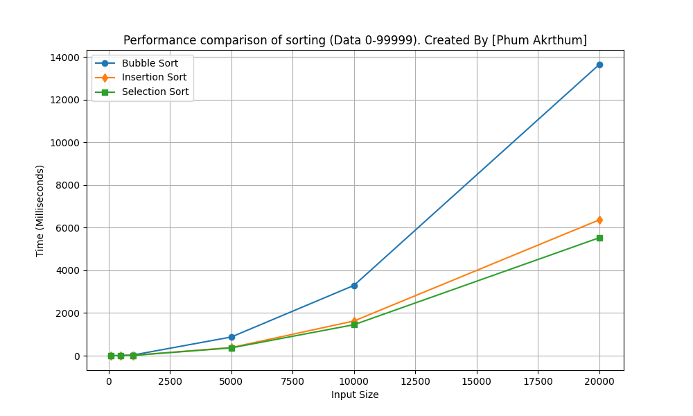

ผลการเปรียบเทียบ Selection sort, shell sort, quick sort

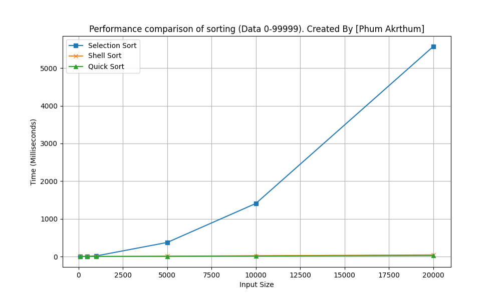

ผลการเปรียบเทียบ shell sort, quick sort, merge sort,radix sort, couting sort
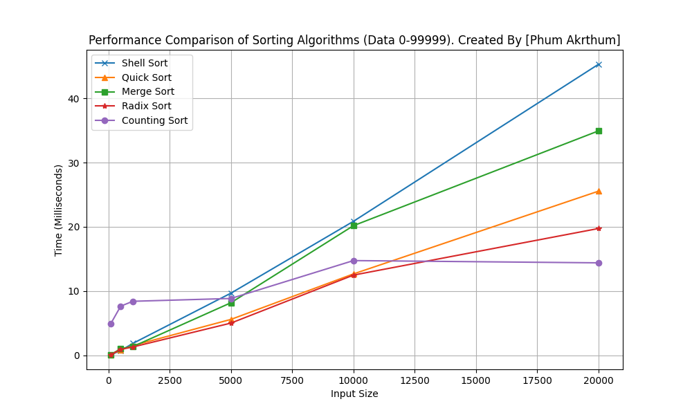


4. ทดลองเปลี่ยนขนาดอินพุต 
   
   ```python
    # ทดสอบกับขนาดข้อมูลต่างๆ
    # sizes = [100,500, 1000, 5000, 10000, 20000]
    sizes = [1000,5000, 10000, 20000, 40000,100000]
    ```

    ผลการเปรียบเทียบ shell sort, quick sort, merge sort,radix sort, couting sort (กรณี Data 0-999)

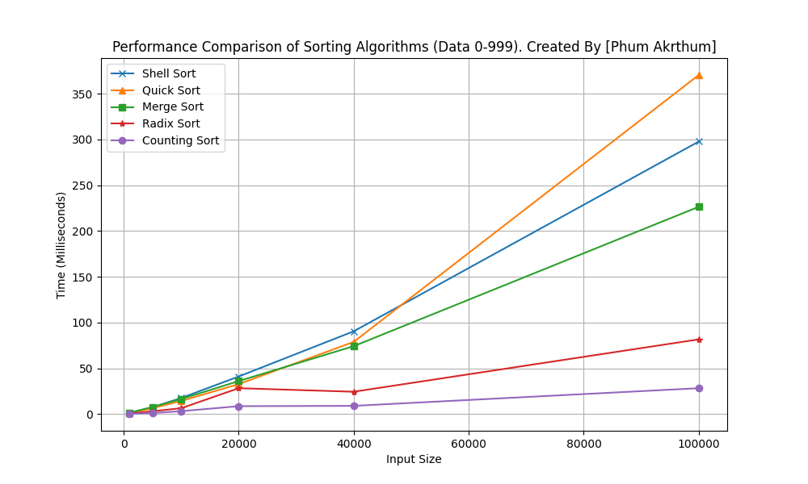

    ผลการเปรียบเทียบ shell sort, quick sort, merge sort,radix sort, couting sort (กรณี Data 0-99999)

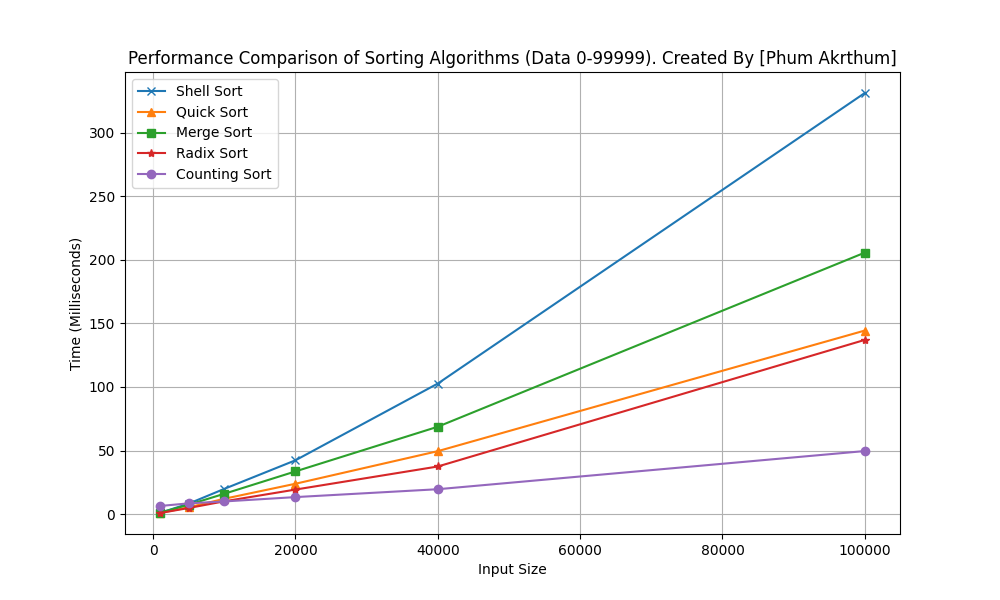

    ผลการเปรียบเทียบ shell sort, quick sort, merge sort,radix sort, couting sort (กรณี Data 0-999999)

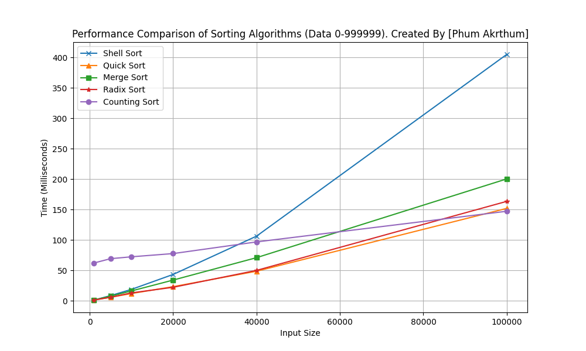


### สรุปผลการลอง เปรียบเทียบประสิทธิภาพของการเรียงข้อมูลแต่ละแบบ เมื่อใช้กับข้อมูลขนาดเล็ก ขนาดใหญ่ และข้อมูลที่มีความความแตกต่างของข้อมูลน้อย และความแตกต่างของข้อมูลมาก

```html
เขียนสรุปผลการทดลองที่นี่

เมื่อทำการเปรียบเทียบประสิทธิภาพของอัลกอริธึมการเรียงข้อมูล Bubble Sort, Insertion Sort, Selection Sort, Shell Sort, Quick Sort, Radix Sort, และ Counting Sort ในสถานการณ์ต่างๆ 
สรุปผล:
เมื่อใช้กับข้อมูลขนาดเล็ก: Bubble Sort, Insertion Sort, และ Selection Sort ยังทำงานได้พอสมควร, แต่ Shell Sort, Quick Sort จะได้ผลดีกว่าเมื่อขนาดข้อมูลเพิ่มขึ้น
เมื่อใช้กับข้อมูลขนาดใหญ่: Bubble Sort, Insertion Sort, และ Selection Sort จะช้าลงอย่างมาก, ในขณะที่ Shell Sort, Quick Sort, Radix Sort, และ Counting Sort จะทำงานได้ดีขึ้น
เมื่อข้อมูลเกือบเรียงลำดับแล้ว: Bubble Sort และ Insertion Sort จะได้ผลดีในกรณีนี้, แต่ Quick Sort อาจทำงานไม่ดีหากเลือก pivot ที่ไม่เหมาะสม
เมื่อข้อมูลสุ่ม: Quick Sort, Radix Sort, และ Counting Sort จะทำงานได้ดีกว่าเนื่องจากวิธีการแบ่งข้อมูลที่มีประสิทธิภาพ
การเลือกอัลกอริธึมที่เหมาะสมที่สุดจะขึ้นอยู่กับขนาดของข้อมูล, รูปแบบของข้อมูล (เรียงลำดับแล้วหรือสุ่ม), และข้อจำกัดของเวลาในการประมวลผล.
``` 
